# Node-API-REST
- [Creando servidor con Express](#express)
- [Iniciar con Docker compose](#pasos-para-iniciar-docker-con-node)

<h2 id="express">Creando mi primer servidor con Express</h2>

Para poder crear tu primer servidor con express debes tener instalado Node JS en tu ordenador.
Te dejo el [link](https://nodejs.org/es) de descarga.
Luego de la instalación de node crea una carpeta en tu ordenador en mi caso lo hare en _documentos/cursos/node-api-rest_ y dentro de esa carpeta creare un archivo _index.js_ que sera el principal.
1. Iniciamos _npm_:

```bash
npm init -y
```

2. Procedemos a instalar express y otras dependencias:

```bash
npm i eslint eslint-config-prettier eslint-plugin-prettier pritter -D
```
__Nota:__ te recomiendo instalar _nodemon_ de manera global:
```bash
npm i nodemon -g
```

3. Añadimos un archivo _.gitignore_ que lo dejare [aqui](./.gitignore).
4. Añadimos otros archivos de configuración para buenas prácticas:
    - Crear archivo _.eslinttrc.json_ con el siguiente contenido:
    ```json
    {
      "parserOptions": {
        "ecmaVersion": 2018
      },
      "extends": [
        "eslint:recommended",
        "prettier"
      ],
      "env": {
        "es6": true,
        "node": true,
        "jest": true
      },
      "rules": {
      "no-console": "warn"
      }
    }
    ```
    - Crear archivo _.editorconfig_ con el siguiente contenido:
    ```bash
    [*]
    charset = utf-8
    indent_style = space
    indent_size = 2
    insert_final_newline = true
    trim_trailing_whitespace = true

    [*.js]
    quote_type = single

    [*.md]
    max_line_length = off
    trim_trailing_whitespace = false
    ```
5. Por ultimo creamo nuestro archivo _index.js_ con el siguiente codigo:

    ```js
    const express = require('express');
    const data = require('./products.json');
    const app = express(); //usando constante de express
    const port = 3000;

    // definiendo rutas
    app.get('/', (request, response) => {
      response.writeHead(200,{'Content-Type':'text/html'});
      response.write("<h1>Login</h1>");
      console.log(request.url);
    })

    app.listen(port, function(){
      console.log(`Escuchando en: localhost:${port}/`);
    });
    ```
6. Creamos nuestros scripts para correr el servidor, nos vamos al archivo _package.json_ en el apartado de _"scripts"_ colocamos lo siguiente:
    ```json
      "dev": "nodemon ./index.js",
      "start": "node ./index.js",
      "lint": "eslint"
    ```
7. Nos dirigimos a la terminal y escribimos lo siguiente para poder tener un servidor que se reinicie con cambios que hagamos automaticamente:
    ```bash
    npm run dev
    ```

Aparecera un mensaje como este:
<div align="center">
  
</div>
9. Nos vamos a nuestro navegador y escribimos esto:

<pre>localhost:3000</pre>
<div align="center">
  
</div>

Y listo tenemos nuestro primer servidor con _Express_


## Pasos para iniciar docker con node
Crear el archivo de docker-compose
```bash
touch docker-compose.yml
```

Abrimos VS Code
```bash
code .
```

Colocamos dentro del archivo de docker-compose lo siguiente para administrarlo sin necesidad de instalar drivers o aplicaciones de mas

```bash
version: '3.3'

services:
  postgres:
    image: postgres:15
    environment:
      - POSTGRES_DB=store
      - POSTGRES_USER=noriega
      - POSTGRES_PASSWORD=server2023$
    ports:
      - 5432:5432
    volumes:
      - ./postgres_data:/var/lib/postgresql/data
```

## Crear contenedor con docker-compose
Luego de tener tu configuracion realizaremos lo siguiente dentro de la linea de comandos (terminal):

```bash
docker-compose up -d postgres
```

__NOTA:__ postgres es porque ese el nombre del servicio en caso pusieras otro lo cambias

Verificaremos si esta corriendo el contenedor

```bash
docker-compose -ps
```

Para parar el contenedor hacemos lo siguiente

```bash
docker-compose down
```

## Explorando terminal e interfaz de postgres
Primero lo veremos desde la terminal y usaremos el siguiente comando:

```bash
docker-compose exec postgres bash
```

Nos conectara a la base de datos vía terminal

Para navegar dentro de ella:
```bash
ls -l
```

### Conectarse a la base de datos por terminal
Colocaremos esto una vez estemos dentro del contenedro de postgres

```bash
psql -h localhost -d store -U noriega
```

__NOTA:__ -h es para indicar el host, -d para indicar la base de datos y -U es para indicar el nombre de usuario

### Agregar servicio de PGAdmin4

En caso no nos sintamos muy comodos utilizando la base de datos por medio de la terminal podemos hacerlo por medio de PGAdmin4, pero tendremos que realizar unas configuraciones mas a al archivo de _docker-compose.yml_ agregaremos un servicio más.

```bash
version: "3.3"

services:
  postgres:
    image: postgres:15
    environment:
      - POSTGRES_DB=store
      - POSTGRES_USER=noriega
      - POSTGRES_PASSWORD=server2023$
    ports:
      - 5432:5432
    volumes:
      - ./postgres_data:/var/lib/postgresql/data

  pgadmin:
    image: dpage/pgadmin4
    environment:
      - PGADMIN_DEFAULT_EMAIL=admin@gmail.com
      - PGADMIN_DEFAULT_PASSWORD=root
    ports:
      - 5050:80
```

Ahora tendremos que hacer que pgadmin corra en un contenedor.

```bash
docker-compose up -d pgadmin
```

Justo ahora tendriamos que tener dos servicios: el de la base de datos de postgresql y pgadmin4.

## Ingresar a pgAdmin4
Para poder ingresar a pgAdmin4 tendremos que revisar las configuraciones que realizamos con en el capitulo anterior, tendremos que ver cual es el puerto que expuso nuestra máquina anfitriona para pgAdmin, en nuestro caso es __5050__. ahora vamos a al navegador para colocar la siguiente direccion:

```bash
localhost:5050
```

<div align="center">


</div>

Despues de un momento tendriamos que tener una pantalla similar a la imagen que se muestra a continueación.

<div align="center">


</div>

Luego tendremos que ingresar un correo y una contraseña, las que previamente colocamos en nuestro archivo de _docker-compose.yml_, en nmi caso coloque lo siguiente:

<div align="center">

| Variable | Valor |
| :--: |  :--:  |
| email | admin@gmail.com |
| password | root |

</div>

Colocamos los datos correspondientes, tendremos que crear nuestro servidor para poder crear la base de datos, realizaremos lo siguiente:

1. Damos click derecho en el boton de __Servers__, luego damos click izquierdo en __Register__ y por ultimo click izquierdo en __Server__.

<div align="center">

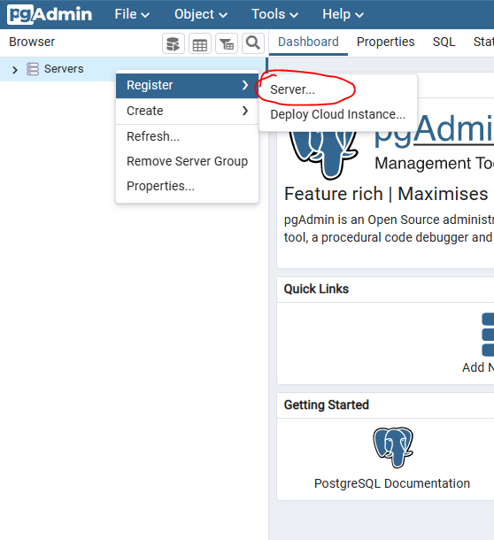

</div>

2. Luego tendremos una pantalla como la siguiente donde tendremos que llenar un solo campo (los demas son opcionales).

<div align="center">

|Campo|Valor|
|:--:|:--:|
|Name|nombre del servidor nuevo|
|Server group|grupo donde estara nuestro nuevo servidor|
|Background|para establecer un color de fondo en el servidor (no recomendado)|
|Foreground|para establecer un color de letra en el servidor (no recomendado)|

</div>

<div align="center">

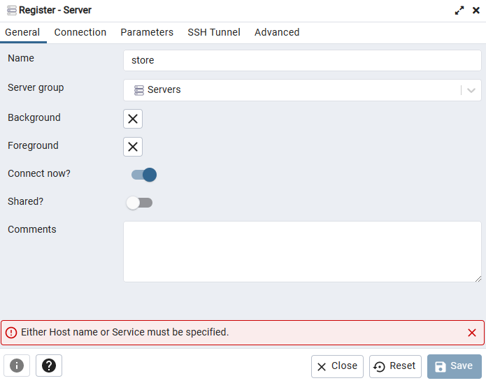


</div>

3. Luego nos vamos a la opcion de __Connection__ y se divide en lo siguiente:

<div align="center" id="img-datos-postgres">

| Campo | Valor |
| :-- | :-- |
|Host name/address| nombre del host para postgres o direccion IP|
|Port|numero de puerto para que postgres se conecte|
|Maintenance database|el nombre de la base de datos|
|Username|nombre de usuario de postgres|
|Password|password de postgres|
|Save Password?|guardar password|

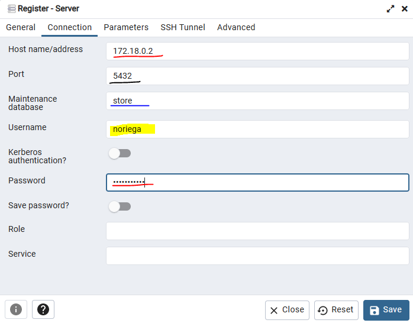

</div>

__NOTA:__ Todo a excepción de la dirección IP esta dentro del archivo ___docker-compose.yml___

### Ver direccion IP del contenedor de postgres

Sabemos que nuestra DB esta corriendo en un contenedor de Docker, en la imagen hay una direccion IP pero no quiere decir que siempre sea la misma, entonces __¿Como hacemos para ver la dirección IP de postgres desde su contenedor?__, lo haremos de la siguiente manera:

1. Nos dirigimos a la terminal y colocamos lo siguiente:
```bash
docker ps
```

Y mostrara los contenedores que se estan corriendo pero nos centraremos en el __ID del contenedor de postgres__ como lo muestra la siguente imagen

<div align="center">

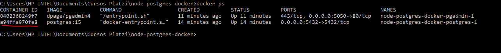

</div>

2. Luego ejecutamos el comando para inspeccionar el contenedor:

```bash
docker inspect <id-del-contenedor>
```

Ejemplo:
<pre>docker inspect a9852dddfa3</pre>

El resultado tendria que ser como el siguiente:

<div align="center">

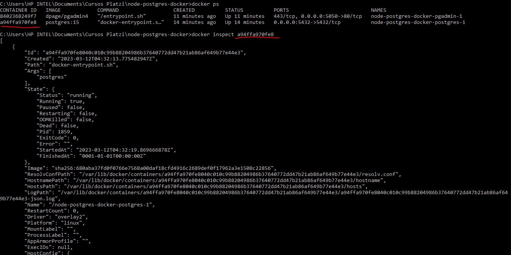

</div>

Luego navegamos dentro de la terminal hasta la parte de abajo y buscamos dentro de campo __Networks__ la direccion __IP del contenedor de postgres__.

<div align="center">

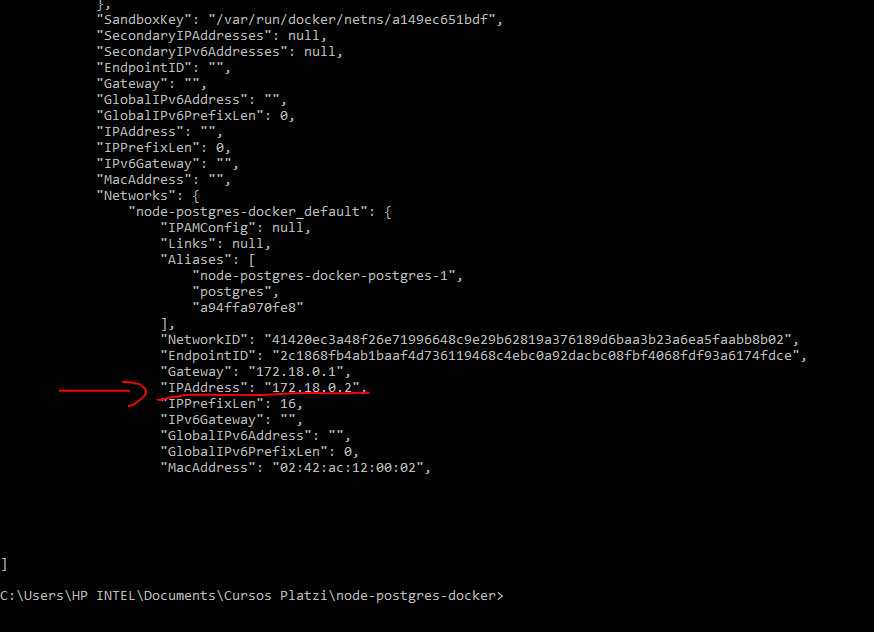

</div>

Justo esa direccion IP es la que colocaremos en la interfaz de pgAdmin4 como estaba en la [imagen anterior](#img-datos-postgres)

3. Por ultimo daremos click izquierdo en el botón __Save__.

¡Ya tenemos nuestra base de datos!

### Crear una tabla de pruebas de pgAdmin4

1. Para crear la tabla daremos click en __store__ luego en __Databases__.

2. Luego click en __store__.
3. Click en __Schemas__.
4. Click en __public__.
5. Click derecho en __Tables__.
6. Click en __Create__ y luego en __Table...__


Pasos de forma gráfica:

<div align="center">

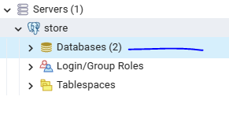
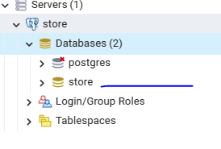
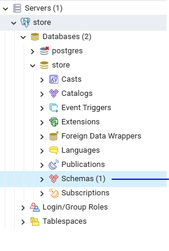
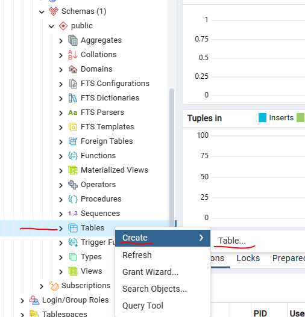

</div>

Ahora tendremos una ventana para crear la tabla de prueba, la cual tendra los siguientes datos para llenar:

<div align="center">

|Campo|Valor|
|:--:|:--:|
|Name|nombre de la tabla|
|Owner|propietario de la tabla|
|Schema|Tipo de esquema|

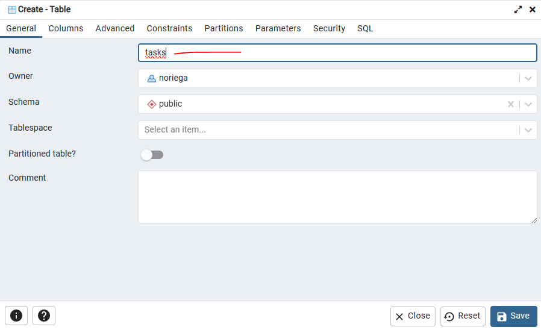

</div>

Ahora damos click en __Columns__ que esta en la parte superior de esa ventana y haremos los siguientes pasos:

1. Daremos click en el boton con un simbolo de __+__ para agregar una columna a nuestra tabla.

2. Tendremos que llenar algunos campos, no todos son requeridos.

<div align="center">

Nombre|Tipo de dato|Tamaño|Not NULL|Primary Key?|Default|
|:--:|:--:|:--:|:--:|:--:|:--:|
|id|serial||Si|Si||
|title|character varying||Si|No||
|completed|boolean||No|No|false|

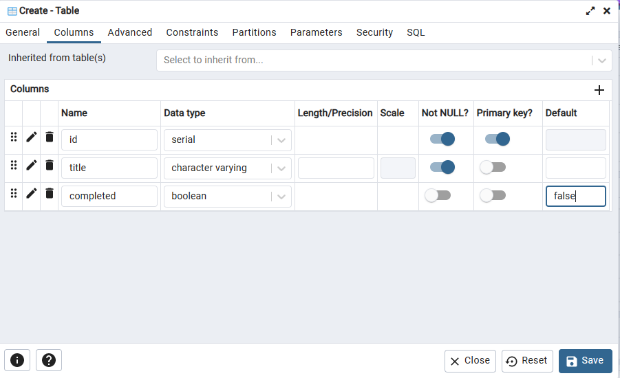

</div>

3. Damos click al botón de __Save__.

Listo, tendremos nuestra tabla de pruebas para realizar peticiones.

## Integración de postgres con node

Para poder conectar directamente Node con postgres nos dirigiremos a la siguiente [documentación](https://node-postgres.com) en donde encontraremos los pasos para poder realizar la conexión

### Instalación de PG

Para poder hacer que node se conecte con postgres necesitaremos de una libreria llamada _pg_

```bash
npm i pg
```

Para tener un mayor orden en el código podemos crear una carpeta llamada _libs_ donde estaremos guardando configuraciones para librerias que utilizaremos (conexion a terceros DB o APIS).

```bash
mkdir libs
```

Dentro de ella agregaremos un archivo llamado _postgres.js_

```bash
touch postgres.js
```

Realizamos los cambios dentro del archivo
```js
const { Client } = require('pg');


async function getConnection(){

  const client = new Client({
    host: 'localhost',
    port: 5432,
    user: 'noriega',
    password: 'server2023$',
    database: 'store'
  });

  await client.connect();
  return client;
}

module.exports = getConnection();
```

__NOTA:__ la libreria necesita usar _async/await_

### Crear un pool de conexiones

El capitulo anterior vimos que podemos crear una conexion por medio de node y postgres, pero no es una forma tan optima, porque si hay varios usuarios dentro de nuestra app, necesitaremos tener varias conexiones para ellos, entonce aqi entran las _pool connection_ y lo hacemos de la siguiente manera:

Creamos un nuevo archivo llamado _postgres.pool.js_ dentro de la carpeta _libs_

```bash
cd libs
```

```bash
touch postgres.pool.js
```

Dentro del archivo de _postgres.pool.js_ agregamos el siguiente codigo

```js
const { Pool } = require('pg');

const pool = new Pool({
  host: 'localhost',
  port: 5432,
  user: 'noriega',
  password: 'server2023$',
  database: 'store'
});

module.exports = pool;
```

Luego de esto nos dirigimos a nuestra carpeta _controllers_ y creamos un nuevo archivo para realizar las pruebas de conexion a la base de datos.

```js
const pool = requite('../libs/postregres.pool');
const controller {}

controller.getTasks = async (request, response) => {
  const query = 'SELECT *FROM tasks';
  pool.on('error', err => console.error(err)); //en caso de un error de conexion
  const getResult = await pool.query(query);
  return response.json(getResult.rows);
}

module.exports = controller;
```

Procedemos a agregar un archivo nuevas rutas dentro de nuestra carpeta _routers_ al archivo _test.router.js_ para poder hacer uso de esta direccion en la web

```js
const express = require('express');
const router = express.Router();
const controller = require('../controllers/tasks.controller');

router.get('/', controller.getTasks);

module.exports = router;
```

### Variables de ambiente con node

De las maneras que se utilizaron para realizar conexiones y consultas a la base de datos es necesario saber que es una mala practica colocar __datos sensibles__ en caso alguien logre interceptar las credenciales a la DB se corre un riesgo, para eso utilizaremos node para crear variables de ambiente

Creamos una carpeta llamada _config_, luego dentro de esa carpeta creamos un archivo llamado _config.js_ para lograr hacer las configuraciones de las variables de ambiente.

```bash
mkdir config
```

```bash
touch config.js
```

Dentro del archivo config colocaremos lo siguiente

```js
require('dotenv').config();

const config = {
    env: process.env.NODE_ENV || 'dev',
    port: process.env.NODE_PORT || 3000,
    dbUser: process.env.DB_USER,
    dbPassword: process.env.DB_PASSWORD,
    dbHost: process.env.DB_HOST,
    dbName: process.env.DB_NAME,
    dbPort: process.env.DB_PORT,
}

module.exports =  { config };
```

__NOTA:__ para que esto funcione debes descargar la libreria de ___dotenv___ para poder acceder a las variables de ambiente.

Luego dentro de la carpeta _libs_ en el archivo de _postgres.pool.js_ debemos de colocar el siguiente codigo.

```js
const { Pool } = require('pg');

const { config } = require('../config/config');

const USER = encodeURIComponent(config.dbUser);
const PASSWORD = encodeURIComponent(config.dbPassword);
const URI = `postgres://${USER}:${PASSWORD}@${config.dbHost}:${config.dbPort}/${config.dbName}`;

const pool = new Pool({ connectionString: URI });

module.exports = pool;
```

Creas un archivo _.env_ para poder hacer la busqueda de las variables de ambiente con node

```bash
touch .env
```

Dentro del archivo _.env_ se deberia de ver algo asi:

```bash
PORT=3000
DB_USER='noriega'
DB_PASSWORD='server2023$'
DB_HOST='localhost'
DB_NAME='store'
DB_PORT='5432'
```

Por ultimo volvemos a correr la aplicacion

```bash
npm run dev
```

Realizamo la consulta por medio de _postman_, _insomnia_ o _thunder client_ de la siguiente manera:

```bash
http://localhost:3000/api/v1/task
```

Tendremos nuestros datos para poder visualizar la consulta realizada con las variables de entorno.

## Instalacion y configuración de Sequelize (ORM)

Para iniciar debemos de saber lo más simple, ¿Qué es un ORM? lo explicaremos de manera sencilla, un __ORM (Object Relational Model)__ transforma y mapea a nuestra DB con metodos de la programacion orientada a objetos, se ejecutan metodos a travez de consultas

### Ventaja de usar un ORM

Es agnóstico, no importa si se esta usando MYSQL, PostgreSQL, MariaDB, Oracle, etc, siempre y cuando la DB use SQL.

Para instalar sequelize en nuestro proyecto haremos uso de lo siguinte

```bash
npm install --save pg pghstore
```

Ya que se esta trabajando con postgres en caso de utilzar otras DB podemos ver la [documentacion oficial](https://sequelize.org/docs/v6/getting-started/) de sequelize

Luego de instalar la libreria de sequelize, dentro de la carpeta de _libs_ crearemos un archivo llamado _sequelize.js_ para nuestra conexión con node.

```js
const { Sequelize } = require('sequelize');
const { config } =  require('../config/config');

const USER = encodeURIComponent(config.dbUser);
const PASSWORD = encodeURIComponent(config.dbPassword);
const URI = `postgres://${USER}:${PASSWORD}@${config.dbHost}:${config.dbPort}/${config.dbName}`;

/**
 * @logging hay dos opciones true o false, en caso de dar un error colocar console.log
 * @dialect indicar a que DB nos vamos a conectar
 */
const sequelize = new Sequelize(URI, {
    dialect: 'postgres',
    logging: console.log,
});

module.exports = sequelize;
```

Luego de eso procedemos a ir a nuestro archivo de _task.controller.js_ en la carpeta de _controllers_ y agregaremos una funcion para probar el ORM.

__NOTA:__ el archivo que modificaremos tendrá codigo de una conexión con ___pool___ es opcional dejarlo o no, solo esa para fines educativos (en nuestro caso lo eliminaremos).

```js
const sequelize = require('../libs/sequelize');
const controller = {};

controller.getTasksSequelize = async (request, response) => {
    const query = 'SELECT *FROM tasks';
    const [data, metadata] = await sequelize.query(query);
    return response.json(data);
}

module.exports = controller;
```

Luego iremos a la carpeta _routes_ para crear la ruta de la nueva consulta en el archivo de _test.router.js_

```js
const express = require('express');
const router = express.Router();
const controller = require('../controllers/tasks.controller');

router.get('/sequelize', controller.getTasksSequelize);

module.exports = router;
```

Y para comprobar que esta funcionando, corremos nuestra app.

```bash
npm run dev
```

Luego nos dirigimos a _postman_ para realizar la consulta a la siguiente direccion

```bash
http://localhost:3000/api/v1/test/sequelize
```

Y listo, tenemos nuestra primera consulta con el __ORM__

## Primer modelo con sequelize

Para crear un modelo con sequelize hay varias formas y son mediante clases y herencias, pero por el momento veremos una de ellas. Crearemos una carpeta llamada _db_ dentro de ella crearemos otra carpeta llamada _models_.

Dentro de la carpeta models creamos un archivo llamado _user.model.js_ y dentro de el agregaremos el siguiente codigo

```js
const { Model, DataTypes, Sequelize } = require('sequelize');

// buena paractica para definir cual sera el nombre de nuestra tabla
const USER_TABLE = 'users';

//crear el esquema que queremos que haga la DB
const UserSchema = {
    id: {
        allowNull: false, //permitir que el campo sea o no nulo
        autoIncrement: true, //campo incrementable
        primaryKey: true, // llave primaria
        type: DataTypes.INTEGER, // que tipo de valor recibira
    },
    username:{
      allowNull: false,
      type: DataTypes.STRING,
      unique: true, //tipo de campo unico
    },
    email: {
        allowNull: false,
        type: DataTypes.STRING,
        unique: true, //tipo de campo unico
    },
    password: {
        allowNull: false,
        type: DataTypes.STRING
    },
    createdAt: { //
        allowNull: false,
        type: DataTypes.DATE,
        field: 'created_at', //definir el nombre de la columna
        defaultValue: Sequelize.NOW //insertar fecha por fecto
    }
};

class User extends Model {
    static associate() {
        //models = definiendo todas las relaciones
    }

    static config(sequelize){
        return {
            sequelize,
            tableName: USER_TABLE,
            modelName: 'User',
            timestamps: false,
        }
    }
}

module.exports = { USER_TABLE, UserSchema, User }
```

Ahora crearemos en la misma carpeta un archivo llamado _index.js_ con el siguiente codigo (siempre en la misma carpeta).

```js
const { User, UserSchema } = require('./user.model');

function setupModels(sequelize){
    User.init(UserSchema, User.config(sequelize)); //enviar un modelo de esquema y configuracion
}

module.exports = setupModels;
```

Ahora editaremos de nuevo el archivo _sequelize.js_ de la conexión con la DB _(libs/sequelize.js)_

```js
const { Sequelize }= require('sequelize');
const { config } =  require('../config/config');
const setupModels =  require('../db/models');

const USER = encodeURIComponent(config.dbUser);
const PASSWORD = encodeURIComponent(config.dbPassword);
const URI = `postgres://${USER}:${PASSWORD}@${config.dbHost}:${config.dbPort}/${config.dbName}`;

/**
 * @logging hay dos opciones true o false, en caso de dar un error colocar console.log
 * @dialect indicar a que DB nos vamos a conectar
 */
const sequelize = new Sequelize(URI, {
    dialect: 'postgres',
    logging: console.log,
});

setupModels(sequelize); //enviando conexion

// hacer una sincronizacion de las comlumnas de las tablas
sequelize.sync();

module.exports = sequelize;
```

Ahora editaremos el archivo de _users.controller.js_ que se encuentra en la carpeta _controller_

__NOTA:__ solo agregaremos una linea al principio del archivo y editaremos la funcion __getUsers__

```js
const { models } = require('../libs/sequelize');

controller.getUsers = async (request, response) => {
  const { size } = request.query;
  const datos = [];
  const limit = size || 10;

  // User viene del archivo user.model.js dentro de la clase de User en el metodo estatico hay un valor llamado modelName:User
  const rows = await models.User.findAll();
  return response.json(rows);
}
```

Si nosotros ingresamos a la ruta para poder ver a los usuarios que estan registrados.

```bash
http://localhost:3000/api/v1/users
```

No tendremos nada de información, porque la tabla aun esta vacia, entonces agregaremos datos dentro de __pgadmin__

```sql
INSERT INTO public.users(username,email, password, created_at)
	VALUES ('dnoriega','dnoriega@gmail.com', 'admin123', NOW()),
	('cindyardon','cindyardon@gmail.com','cindy123',NOW()),
	('msalazar','msalazar@gmail.com','msalazar123', NOW()),
	('fgourlay2','fgourlay2@gov.uk','fgourlay2',NOW()),
	('servidor','servidor@microsoft.com','servidor123',NOW()),
	('platzi123','platzi.team@platzi.com','platzi123',NOW());

-- Ver loca datos insertados en la tabla users
SELECT *FROM public.users;
```

Y listo podremos probar que los datos si estan recibiendo.

### Crud con sequelize y postgres

Realizaremos el crud para los usuarios, iremos a la carpeta de _controller_ para posteriormente editar el archivo _users.controller.js_ en las funciones de _getUsers_, _update_, _findUser_ y _newUser_

Función getUsers:

```js
controller.getUsers = async (request, response, next) => {
  const { size } = request.query;
  const datos = [];
  const limit = size || 10;

  const rows = await models.User.findAll();
  return response.json(rows);
}
```

Función findUser:

```js
controller.findUser = async (request, response, next) => {
  const id = Number(request.params.id);

  const find = await models.User.findByPk(id);
  if (!find) {
    return response.json({ error: "Not Found", description: "User don´t exist in DB" })
  } else {
    return response.json(find);
  }
}
```

Función newUser:

```js
controller.newUser = async (request, response, next) => {
  try {
    const body = request.body;
    const passHash = await bcrypt.hash(body.password, 10); //hash de encriptacion

    const datos = {
      username: body.user_name,
      email: body.email,
      password: passHash,
    };

    const newUser = await models.User.create(datos);
    //console.log(newUser);
    response.json(newUser);
  } catch (err) {
    next(err);
  }
}
```

Función deleteUser:

```js
controller.deleteUser = async (request, response) => {
  const id = Number(request.params.id);
  // const find = await models.User.findByPk(id);
  const find = await models.User.findByPk(id);
  if (!find) {
    return response.status(404).json({ statusCode: 404, error: "Not Found", "message": "User not found" });
  }
  const deleted = await find.destroy();

  return response.json(find);
}
```

Función update:

```js
controller.update = async (request, response) => {
  const id = Number(request.params.id);
  const body = request.body;
  let userUpdate = {
    username: body.user_name,
    email: body.email,
  };

  if (body.password !== undefined) {
    const passHash = await bcrypt.hash(body.password, 10);
    userUpdate = {
      username: body.user_name,
      email: body.email,
      password: passHash,
    }
  }

  const user = await models.User.findByPk(id);
  if (!user) {
    return response.status(404).json({ statusCode: 404, error: "Not Found", "message": "User not found" });
  }

  const updated = await user.update(userUpdate);
  return response.json(updated);
}
```
<div id="ejemplos-crud"></div>
Probamos cada una de las rutas en postman

- Mostrar todos los usuarios (__GET__)
```bash
http://localhost:3000/api/v1/users
```

- Buscar usuario especifico con ID (__GET__)

```bash
http://localhost:3000/api/v1/users/2
```

- Borrar un usuario(__DELETE__)

```bash
http://localhost:3000/api/v1/users/2
```

- Crear un nuevo usuario (__POST__)
```bash
http://localhost:3000/api/v1/users
```

Ejemplo para el body en postman:
```json
{
  "username":"dnoriega",
  "email":"dnoriega@gmail.com",
  "password":"dnoriega",
}
```

- Actualizar un usuario por ID (__PATCH__)
```bash
http://localhost:3000/api/v1/users/1
```

Ejemplo para el body en postman:
```json
{
  "username":"test",
  "email":"test@gmail.com",
  "password":"testpass123",
}
```

## CRUD con sequelize y mysql

Antes vimos como hacer un crud con postgres, pero lo bueno de usar sequelize es que no tenenmos que cambiar nada en las consultas de SQL o la estructura de las funciones de usuarios, lo unico que se tiene que realizar es cambiar la conexión de la DB y agregar unas librerias para que pueda funcionar

- Agregar la libreria para que sea compatible con mysql:

```bash
npm install --save mysql2
```

Ahora agregaremos el servicio de mysql y phpmyadmin para la interfaz gráfica dentro del archivo de ___docker-compose.yml___ de la siguiente manera.

```bash
  mysql:
    image: mysql
    environment:
      - MYSQL_DATABASE=store
      - MYSQL_USER=noriega
      - MYSQL_ROOT_PASSWORD=server2023$
      - MYSQL_PORT=3306
    ports:
      - 3306:3306
    volumes:
      - ./mysql_data:/var/lib/mysql

  phpmyadmin:
    image: phpmyadmin
    environment:
      - MYSQL_ROOT_PASSWORD=server2023$
      - PMA_HOST=mysql
    ports:
      - 8080:80
```

Son casi que las mismas configuraciones de postgres, lo unico que cambian son las conexiones de puertos, nombre de variables de entorno y en donde se guardaran los volumenes de mysql.

Ahora creamos la carpeta donde se guardara el volumen de mysql

```bash
mkdir mysql_data
```

Configuramos en nuestro archivo __.env__ las nuevas conexiones de puertos y nombres de usuario:

```bash
DB_USER='root'
DB_PORT='3306'
```

__NOTA:__ son las unicas que se necesitan cambiar.

Ahora nos vamos a la carpeta ___libs___ en el archivo ___sequelize.js___ editaremos la linea ___const URI___ por la siguiente (solo es de editar postgres por mysql)

```js
const URI = `mysql://${USER}:${PASSWORD}@${config.dbHost}:${config.dbPort}/${config.dbName}`;
```

Y tambien la siguiente línea, cambiar postgres por mysql:

```js
const sequelize = new Sequelize(URI, {
    dialect: 'mysql',
    logging: console.log,
});
```

Tenemos todo listo para realizar las pruebas

- Levantamos el servicio de mysql y phpmyadmin

```bash
docker-compose up -d mysql
docker-compose up -d phpmyadmin
```

- Vamos al navegador web para abrir la interfaz de _phpmyadmin_

```bash
localhost:8080
```

- Colocamos nuestras credenciales para inicio de sesión:

<div align="center">

|Campos|Datos|
|:--:|:--:|
|usuario:|root|
|password:|server2023$|

</div>

- Nuestra tabla __store__ se creo con exito, agregaremos información a la tabla desde postman con los [ejemplos](#ejemplos-crud) antes vistos.

Y listo, las grandes ventajas que nos da Docker de poder tener correr varios servicios.


__AGREGAR MIDDLEWARES EN EL README__

## Migraciones con sequelize ORM

Debemos instalar el paquete se _sequelize-cli_ desde la terminal, se instalara como dependencia de desarrollo.

```bash
npm i sequelize-cli -D
```

Ahora agregaremos un archovo de configuracion para las migraciones desde la carpeta raiz qu se llame __.sequelizerc__

```bash
touch .sequelizerc
```

Ahora editaremos el archivo que acabamos de crear co la siguiente informacion para mandarles las rutas de donde estaran las migraciones, seeder y modelos de la DB:

```js
module.exports = {
    'config': './db/config.js',
    'models-path': ' ./db/models/',
    'migrations-path': './db/migrations/',
    'seeders-path': './db/seeders/',
}
```

Procedemos a crear las carpetas de __migrations__ y __seeders__ dentro de la carpeta de __db__

```bash
cd db
```

```bash
mkdir migrations
```

```bash
mkdir seeders
```

Agregamos un __config.js__ denttro de la carpeta __db__.

```bash
touch config-js
```

Dentro del archivo _config.js_ que acabamos de crear copiaremos varias cosas que ya usamos anteriormentee en archivos anteriores.

```js
const { config } = require('../config/config');

const USER = encodeURIComponent(config.dbUser);
const PASSWORD = encodeURIComponent(config.dbPassword);
const URI = `postgres://${USER}:${PASSWORD}@${config.dbHost}:${config.dbPort}/${config.dbName}`;

module.exports = {
    development: {
        url: URI,
        dialect: 'postgres',
    },
    production: {
        url: URI,
        dialect: 'postgres',
    }
}
```

Ahora configuraremos y haremos correr las migraciones con __npm scripts__.

Dentro del archivo _package.json_ agregaremos un nuevo script para ejecutar las migraciones:

```json
"migrations:generate": "sequelize-cli migration:generate --name"
```

Luego nos vamos a la terminal y ejecutamos el nuevo script para que cree la nueva migracion dentro de la carpeta __migrations__:

```bash
npm run migrations:generate create-user
```

Seguido de esto en nuestro archivo __sequelize.js__ (carpeta -> _libs/sequelize.js_) comentaremos la el codigo siguiente porque no sera necesaria ya que trabajaremos por medio de migraciones de ahora en adelante

```js
//sequelize.sync();
```

Editamos el archivo de migracion que creamos hace unos momentos y si eres curioso tiene una sintaxis parecida a la migraciones de _laravel_, entonces agregaremos el siguiente codigo (solo seran dos lineas, pero puedes copiarlo todo de nuevo):

```js
'use strict';

const { USER_TABLE, UserSchema } = require('../models/user.model');

/** @type {import('sequelize-cli').Migration} */
module.exports = {
  async up (queryInterface, Sequelize) {
    await queryInterface.createTable(USER_TABLE, UserSchema);
  },

  async down (queryInterface, Sequelize) {
    await queryInterface.dropTable(USER_TABLE);
  }
};
```

Lo unico que se esta agregando son el modelo y nombre de la tabla de usuarios, ademas de eso se agrego para poder crear una tabla dentro de la BD.

Luego iremos a crear un nuevo script al archivo _package.json_ para poder enviar las migraciones, rollback para las migraciones y eliminar las migraciones.

Script para correr las migraciones
```json
"migrations:run": "sequelize-cli db:migrate"
```

Script para un rollback de las migraciones

```json
"migrations:revert": "sequelize-cli db:migrate:undo"
```

Script para eliminar las migraciones

```json
"migrations:delete": "sequelize-cli db:migrate:undo:all"
```

Ejecutamos el comando para las migraciones y lito deberiamos de tener la tabla de usuarios en la DB.

## Modificando un entidad


