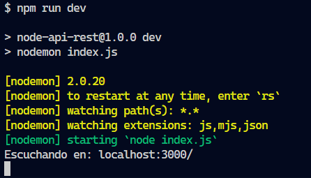
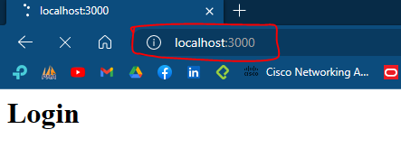

# Node-API-REST
- [Creando servidor con Express](#express)
- [URL´s para peticiones http](#metodos)
- [Iniciar con Docker compose](#pasos-para-iniciar)

<h2 id="express">Creando mi primer servidor con Express</h2>

Para poder crear tu primer servidor con express debes tener instalado Node JS en tu ordenador.
Te dejo el [link](https://nodejs.org/es) de descarga.
Luego de la instalación de node crea una carpeta en tu ordenador en mi caso lo hare en _documentos/cursos/node-api-rest_ y dentro de esa carpeta creare un archivo _index.js_ que sera el principal.
1. Iniciamos _npm_:

```bash
npm init -y
```

2. Procedemos a instalar express y otras dependencias:

```bash
npm i eslint eslint-config-prettier eslint-plugin-prettier pritter -D
```
__Nota:__ te recomiendo instalar _nodemon_ de manera global:
```bash
npm i nodemon -g
```
3. Añadimos un archivo _.gitignore_ que lo dejare [aqui](./.gitignore).
4. Añadimos otros archivos de configuración para buenas prácticas:
    - Crear archivo _.eslinttrc.json_ con el siguiente contenido:
    ```json
    {
      "parserOptions": {
        "ecmaVersion": 2018
      },
      "extends": [
        "eslint:recommended",
        "prettier"
      ],
      "env": {
        "es6": true,
        "node": true,
        "jest": true
      },
      "rules": {
      "no-console": "warn"
      }
    }
    ```
    - Crear archivo _.editorconfig_ con el siguiente contenido:
    ```bash
    [*]
    charset = utf-8
    indent_style = space
    indent_size = 2
    insert_final_newline = true
    trim_trailing_whitespace = true

    [*.js]
    quote_type = single

    [*.md]
    max_line_length = off
    trim_trailing_whitespace = false
    ```
5. Por ultimo creamo nuestro archivo _index.js_ con el siguiente codigo:

  ```js
  const express = require('express');
  const data = require('./products.json');
  const app = express(); //usando constante de express
  const port = 3000;

  // definiendo rutas
  app.get('/', (request, response) => {
    response.writeHead(200,{'Content-Type':'text/html'});
    response.write("<h1>Login</h1>");
    console.log(request.url);
  })

  app.listen(port, function(){
    console.log(`Escuchando en: localhost:${port}/`);
  });
  ```
6. Creamos nuestros scripts para correr el servidor, nos vamos al archivo _package.json_ en el apartado de _"scripts"_ colocamos lo siguiente:
```json
  "dev": "nodemon ./index.js",
  "start": "node ./index.js",
  "lint": "eslint"
```
7. Nos dirigimos a la terminal y escribimos lo siguiente para poder tener un servidor que se reinicie con cambios que hagamos automaticamente:
  ```bash
  npm run dev
  ```

Aparecera un mensaje como este:
<div align="center">
  
</div>
9. Nos vamos a nuestro navegador y escribimos esto:

<pre>localhost:3000</pre>
<div align="center">
  
</div>
Y listo tenemos nuestro primer servido con _Express_

<h2 id="metodos">URL´s para peticiones HTTP</h2>
<h3 id="usuarios">Usuarios</h3>

- [GET](#get)
- [GET + PARAMETROS](#get-params)
- [GET + PAGINACION](#get-pagination)
- [POST](#post)
- [UPDATE](#update)
- [DELETE](#delete)


Para poder obtener todos los datos de la API:
<pre id="get">localhost:3000/api/v1/users</pre>

Para poder buscar un usuario en especifico
<pre id="get-params">localhost:3000/api/v1/users/ID_USUARIO</pre>

Para poder crear un usuario nuevo
<pre id="post">localhost:3000/api/v1/users</pre>

Para actulizar un usuario:
<pre id="post">localhost:3000/api/v1/users/ID_USUARIO</pre>

Para eliminar un usuario:
<pre id="delete">localhost:3000/api/v1/users/ID_USUARIO</pre>


## Pasos para iniciar
Crear el archivo de docker-compose
```bash
touch docker-compose.yml
```

Abrimos VS Code
```bash
code .
```

Colocamos dentro del archivo de docker-compose lo siguiente para administrarlo sin necesidad de instalar drivers o aplicaciones de mas

```bash
version: '3.3'

services:
  postgres:
    image: postgres:15
    environment:
      - POSTGRES_DB=store
      - POSTGRES_USER=noriega
      - POSTGRES_PASSWORD=server2023$
    ports:
      - 5432:5432
    volumes:
      - ./postgres_data:/var/lib/postgresql/data
```

## Crear contenedor con docker-compose
Luego de tener tu configuracion realizaremos lo siguiente dentro de la linea de comandos (terminal):

```bash
docker-compose up -d postgres
```

__NOTA:__ postgres es porque ese el nombre del servicio en caso pusieras otro lo cambias

Verificaremos si esta corriendo el contenedor

```bash
docker-compose -ps
```

Para parar el contenedor hacemos lo siguiente

```bash
docker-compose down
```

## Explorando terminal e interfaz de postgres
Primero lo veremos desde la terminal y usaremos el siguiente comando:

```bash
docker-compose exec postgres bash
```

Nos conectara a la base de datos vía terminal

Para navegar dentro de ella:
```bash
ls -l
```

### Conectarse a la base de datos por terminal
Colocaremos esto una vez estemos dentro del contenedro de postgres

```bash
psql -h localhost -d store -U noriega
```

__NOTA:__ -h es para indicar el host, -d para indicar la base de datos y -U es para indicar el nombre de usuario

### Conectarse por medio de PGAdmin4

En caso no nos sintamos muy comodos utilizando la base de datos por medio de la terminal podemos hacerlo por medio de PGAdmin4, pero tendremos que realizar unas configuraciones mas a al archivo de _docker-compose.yml_ agregaremos un servicio más.

```bash
version: "3.3"

services:
  postgres:
    image: postgres:15
    environment:
      - POSTGRES_DB=store
      - POSTGRES_USER=noriega
      - POSTGRES_PASSWORD=server2023$
    ports:
      - 5432:5432
    volumes:
      - ./postgres_data:/var/lib/postgresql/data

  pgadmin:
    image: dpage/pgadmin4
    environment:
      - PGADMIN_DEFAULT_EMAIL=admin@gmail.com
      - PGADMIN_DEFAULT_PASSWORD=root
    ports:
      - 5050:80
```

Ahora tendremos que hacer que pgadmin corra en un contenedor.

```bash
docker-compose up -d pgadmin
```

Justo ahora tendriamos que tener dos servicios: el de la base de datos de postgresql y pgadmin4.

## Integracion de postgres con node

Para poder conectar directamente Node con postgres nos dirigiremos a la siguiente [documentación](https://node-postgres.com) en donde encontraremos los pasos para poder realizar la conexión

### Instalación de PG

Para poder hacer que node se conecte con postgres necesitaremos de una libreria llamada _pg_

```bash
npm i pg
```

Para tener un mayor orden en el código podemos crear una carpeta llamada _libs_ donde estaremos guardando configuraciones para librerias que utilizaremos (conexion a terceros DB o APIS).

```bash
mkdir libs
```

Dentro de ella agregaremos un archivo llamado _postgres.js_

```bash
touch postgres.js
```

Realizamos los cambios dentro del archivo
```js
const { Client } = require('pg');


async function getConnection(){

  const client = new Client({
    host: 'localhost',
    port: 5432,
    user: 'noriega',
    password: 'server2023$',
    database: 'store'
  });

  await client.connect();
  return client;
}

module.exports = getConnection();
```

__NOTA:__ la libreria necesita usar _async/await_

### Crear un pool de conexiones

El capitulo anterior vimos que podemos crear una conexion por medio de node y postgres, pero no es una forma tan optima, porque si hay varios usuarios dentro de nuestra app, necesitaremos tener varias conexiones para ellos, entonce aqi entran las _pool connection_ y lo hacemos de la siguiente manera:

Creamos un nuevo archivo llamado _postgres.pool.js_ dentro de la carpeta _libs_

```bash
cd libs
```

```bash
touch postgres.pool.js
```

Dentro del archivo de _postgres.pool.js_ agregamos el siguiente codigo

```js
const { Pool } = require('pg');

const pool = new Pool({
  host: 'localhost',
  port: 5432,
  user: 'noriega',
  password: 'server2023$',
  database: 'store'
});

module.exports = pool;
```

Luego de esto nos dirigimos a nuestra carpeta _controllers_ y creamos un nuevo archivo para realizar las pruebas de conexion a la base de datos.

```js
const pool = requite('../libs/postregres.pool');
const controller {}

controller.getTasks = async (request, response) => {
  const query = 'SELECT *FROM tasks';
  pool.on('error', err => console.error(err)); //en caso de un error de conexion
  const getResult = await pool.query(query);
  return response.json(getResult.rows);
}

module.exports = controller;
```

Procedemos a agregar un archivo nuevas rutas dentro de nuestra carpeta _routers_ al archivo _test.router.js_ para poder hacer uso de esta direccion en la web

```js
const express = require('express');
const router = express.Router();
const controller = require('../controllers/tasks.controller');

router.get('/', controller.getTasks);

module.exports = router;
```

### Variables de ambiente con node

De las maneras que se utilizaron para realizar conexiones y consultas a la base de datos es necesario saber que es una mala practica colocar __datos sensibles__ en caso alguien logre interceptar las credenciales a la DB se corre un riesgo, para eso utilizaremos node para crear variables de ambiente

Creamos una carpeta llamada _config_, luego dentro de esa carpeta creamos un archivo llamado _config.js_ para lograr hacer las configuraciones de las variables de ambiente.

```bash
mkdir config
```

```bash
touch config.js
```

Dentro del archiv config colocaremos lo siguiente